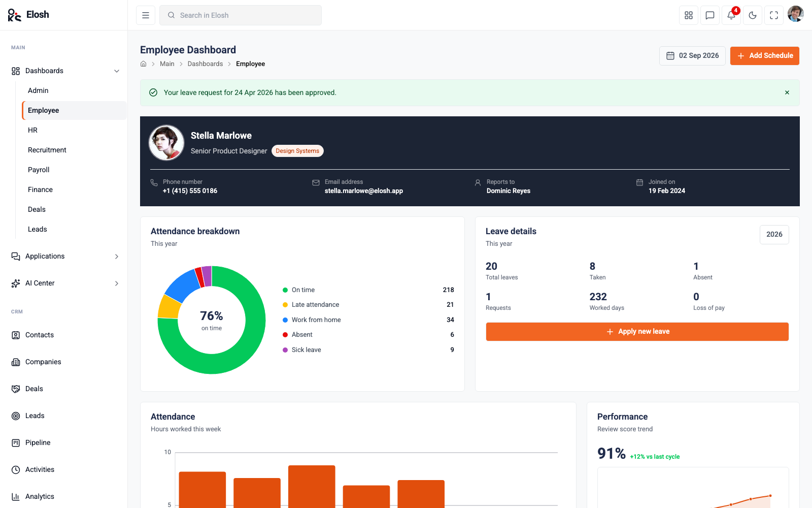

# Elosh

An HR & workforce admin dashboard template built **entirely with [oks-ui](https://www.npmjs.com/package/oks-ui)** — every
button, table, chart, form control, menu and shell element is an oks-ui primitive
or composed from oks-ui parts. No other UI or charting library.

- **Live demo:** _pending first deploy_
- **Repository:** _pending publish_



## Stack

| | |
| --- | --- |
| Framework | Vite + React 19 |
| Language | JavaScript |
| Routing | react-router-dom v7 |
| UI + charts | oks-ui (only) |
| Styling | Tailwind v4 (layout utilities only) + `--app-*` CSS variables |
| Icons | lucide-react |

## Scripts

```bash
npm install
npm run dev      # start the dev server
npm run lint     # oxlint (react + react-hooks)
npm run build    # production build
npm run preview  # preview the build
```

## How the `ui/` layer works

`src/Components/ui/` holds the components oks-ui doesn't ship, each composed from
oks-ui primitives and reading only the `--app-*` token layer defined in
`src/styles/theme.css`:

- `Surface`, `PageHeader`, `SectionTitle` — page scaffolding
- `StatCard`, `DataTable`, `MiniTable`, `EntityCell` — data display
- `ChartCard`, `DonutCard` — `<Chart>` wrappers
- `StatusChip`, `TrendChip` — semantic pills

Screens that are a list, form, settings panel or report are **config objects**
(`src/data/lists.jsx`, `settings.jsx`, `reports.jsx`, `dashboards.jsx`) rendered
through a single archetype page, not bespoke components.

All data is deterministic mock data in `src/data/` — there is no backend.

## Theming

Repoint the `--oks-color-primary-*` ramp in `src/styles/theme.css` and the whole
app re-skins, light and dark. The theme toggle in the header persists to
`localStorage`.

## License

MIT — see [LICENSE](LICENSE). See [CHANGELOG.md](CHANGELOG.md) for release history.
